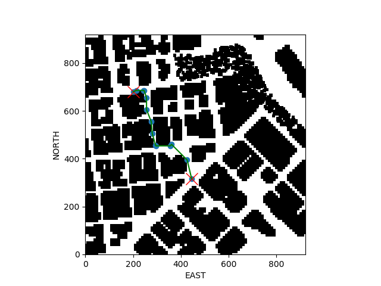
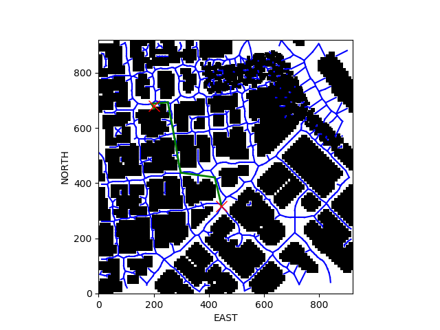

## Project: 3D Motion Planning

---
### Writeup

### Starter Code

#### 1. Functionality - `motion_planning.py` and `planning_utils.py`

motion_planning script is the updated version of the backyard_flyer_solution script where instead of sending a fixed predefined trajectory as waypoints, we discretize the state space either as grids or graphs and plan the trajectory for a given start and goal state which is handled in the planning_util script using planning algorithms like A* given the valid actions and other pre-requisites for it to come up with a best trajectory to reach the goal.

### Implementing Path Planning Algorithm

#### 1. Global home position
Global home position is provided in the first line of `colliders.csv file` and to read & set it in the 'set_home_position' method:

```sh
with open('colliders.csv', 'r') as file:
    reader = csv.reader(file)
    for row in reader:
        lat0 = row[0].split(" ")[1]
        long0 = row[1].split(" ")[2]
        break

self.set_home_position(float(long0), float(lat0), 0)
```

#### 2. Current local position
To calculate Local position relative to our global home position using the utility function `global_to_local()`:

```sh
current_global_pos = self.global_position
current_local_pos = global_to_local(current_global_pos, self.global_home)
```

#### 3. Grid start position from local position
Start position from the calculated local position :

```sh
grid_start = (int(current_local_pos[0]) - north_offset, int(current_local_pos[1]) - east_offset)
```

#### 4. Grid goal position from geodetic coords
Goal position from randomized geodetic coordinates :

```sh
goal_global = [-122.4002093, 37.79577523, 0]
goal_local = global_to_local(goal_global, self.global_home)
grid_goal = (int(goal_local[0]) - north_offset, int(goal_local[1]) - east_offset)
```

#### 5. A* with valid diagonal motion
To include diagonal path as one of the valid action in A*, `class Action(Enum)` and `valid_actions(grid, current_node)` in `planning_utils.py` file are to be modified :

In `class Action(Enum)` :

```sh
NORTH_EAST = (-1, 1, np.sqrt(2))
SOUTH_EAST = (1, 1, np.sqrt(2))
SOUTH_WEST = (1, -1, np.sqrt(2))
NORTH_WEST = (-1, -1, np.sqrt(2))
```

In `valid_actions(grid, current_node)` :

```sh
if x - 1 < 0 or y + 1 > m or grid[x - 1, y + 1] == 1:
    valid_actions.remove(Action.NORTH_EAST)
if x + 1 > n or y + 1 > m or grid[x + 1, y + 1] == 1:
    valid_actions.remove(Action.SOUTH_EAST)
if x + 1 > n or y - 1 < 0 or grid[x + 1, y - 1] == 1:
    valid_actions.remove(Action.SOUTH_WEST)
if x - 1 < 0 or y - 1 < 0 or grid[x - 1, y - 1] == 1:
    valid_actions.remove(Action.NORTH_WEST)   
```

#### 6. Cull waypoints 
Collinearity test (area covered between three points below a tolerance value) and Bresenham method (computationally effective to check if obstacles are present in between two points, implemented with the help of udacity forum) is used to prune the path of unnecessary waypoints in `planning_utils.py` :

```sh
def point(p):
    return np.array([p[0], p[1], 1.]).reshape(1, -1)

def collinearity_check(p1, p2, p3, epsilon=1e-4):   
    m = np.concatenate((p1, p2, p3), 0)
    det = np.linalg.det(m)
    return abs(det) < epsilon

def bresenham_check(p11, p12, p21, p22, grid):
    cells = list(bresenham(p11, p12, p21, p22))
    for cell in cells:
        if grid[cell] == 1:
            return False
    return True

def prune_path(path, grid):
    pruned_path = [p for p in path]
    i = 0
    while i < len(pruned_path) - 2:
        
        p1 = point(pruned_path[i])
        p2 = point(pruned_path[i+1])
        p3 = point(pruned_path[i+2])

        if collinearity_check(p1, p2, p3) or bresenham_check(int(pruned_path[i][0]), int(pruned_path[i][1]), int(pruned_path[i+2][0]), int(pruned_path[i+2][1]), grid):#or bresenham_check(p1, p2, p3):
            pruned_path.remove(pruned_path[i+1])
        else:
            i += 1
    return pruned_path
```

### Flight Execution
#### 1. Does it work?
It works!!

1. Grid Based Approximation :
Goal latitude = 37.79577523, Goal longitude = -122.4002093


Click the following youtube image to checkout the video:
(https://www.youtube.com/watch?v=_0JI_yWPvAE)

2. Graph Based Approximation :
Goal latitude = 37.79577523, Goal longitude = -122.4002093



